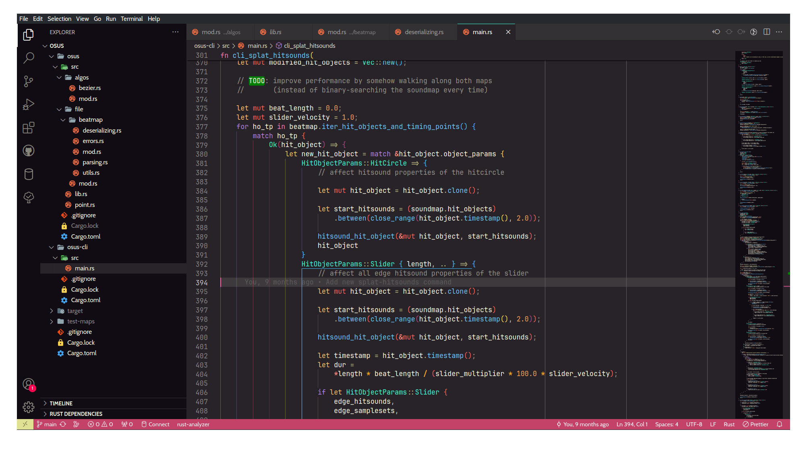

# Moe Codious VSCode color theme

My own Moe color theme. It's starting to feel more moe! :D

## Supported languages

- [x] Rust (primarily)
- [x] C
- [x] Java
- [x] C#
- [x] Perl
- [x] Javascript
- [x] Typescript
- [x] Coffeescript
- [x] Bash/Shell
- [x] Python
- [x] Markdown
- [x] JSON
- [x] YAML

## License

This theme is licensed under the MIT license.
